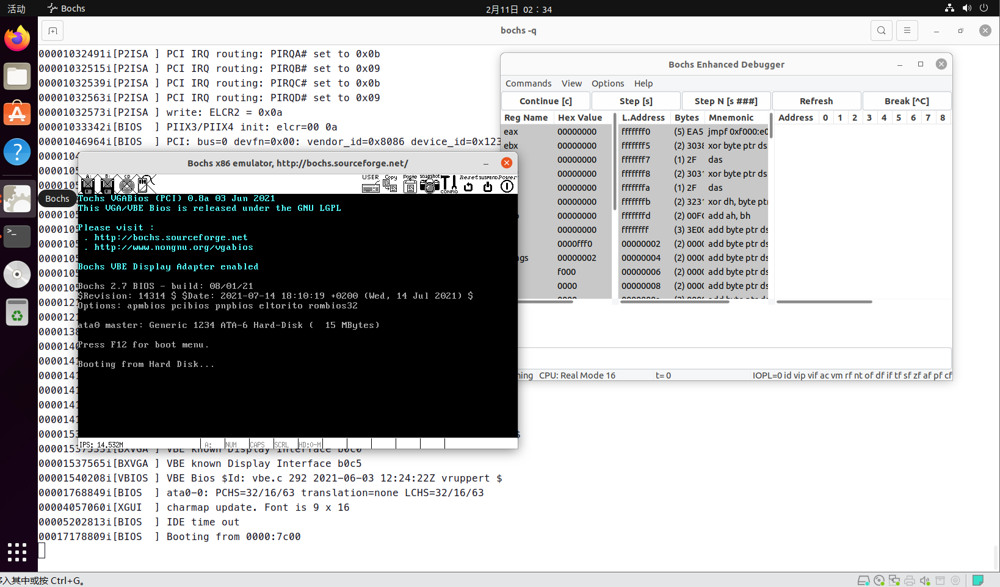

# Ubuntu配置操作系统开发环境

环境配置使用到的工具和镜像：

+ VMware
+ Ubuntu
+ bochs
+ qemu
+ vscode-remote
+ nasm

VMware虚拟机系统版本：Ubuntu 21.10

bochs版本：2.7

## Ubuntu安装bochs
+ 安装编译工具和依赖库

    ```console
    sudo apt-get install build-essential
    sudo apt-get install xorg-dev
    sudo apt-get install libgtk2.0-dev
    ```

+ 在下面链接中找到 `bochs-2.7.tar.gz`并下载
        
    bochs下载地址：https://sourceforge.net/projects/bochs/files/bochs/2.7/

+ 解压,进入解压后目录

    ```console
    tar vxaf bochs-2.6.8.tar.gz
    cd bochs-2.6.8
    ```

+ 输入以下命令，完成`bochs`安装

    ```console
    ./configure --enable-debugger --enable-disasm
    make 
    sudo make install 
    ```

+ 利用以下命令安装`bochs`相关`gui`组件,方便可视化调试

    ```console
    sudo apt-get install bochs-x
    ```

## 开发环境搭建和测试

+ 安装`x86`汇编编译器

    ```console
    sudo apt-get install nasm
    ```

+ 新建`hello.asm`文件，并利用文本编辑器输入以下内容（代码意义后续解释）

    ```s
    mov ax, 0xb800
    mov ds, ax

    mov byte [0], 'T'

    halt:
        jmp halt

    times 510 - ($ - $$) db 0
    db 0x55, 0xaa
    ```

+ 对上面的代码文件进行编译得到`hello.bin`

    ```console
    nasm -f bin hello.asm -o hello.bin
    // -f bin：select output file format:bin(选择编译输出文件格式为bin格式)
    ```

+ 执行命令：
    ```console
    bochs
    ```
    选择 `4. Save options to...`

+ 输入文件名`bochsrc`直接保存

+ 选择`7. Quit now`退出`bochs`

+ 然后创建虚拟磁盘，输入命令
    ```console
    bximage
    ```

+ 选择`1. Create new floppy or hard disk image ` ，按照步骤输入“hd（硬盘）”，两次回车，“16（虚拟硬盘大小）”，这样就创建了一个16M大小的`bochs`可以的虚拟硬盘

    或者利用以下命令直接代替上述操作：
    ```console
    bximage -q -hd=16 -func=create -sectsize=512 -imgmode=flat master.img
    ```

    完成上述步骤后命令行输出下面内容：
    ```console
    The following line should appear in your bochsrc:
    ata0-master: type=disk, path="master.img", mode=flat
    ```
+ 将第二行内容替换到`bochsrc`对应位置，同时将`boot: floppy`改为`boot: disk`（将系统启动方式改为硬盘启动方式），将 `display_library: x`替换为`display_library: x, options="gui_debug" `（bochs启动时自动进入调试模式并弹出调试窗口）

+ 将`hello.bin`写入硬盘：
    ```console
    dd if=hello.bin of=master.img bs=512 count=1 conv=notrunc

    \\if：输入文件，of：输出文件，bs：扇区大小，count：写入扇区数量，conv：写入的截断参数(缺少参数会导致创建16M虚拟硬盘被截断为512扇区大小)
    ```

+ 启动 bochs 测试环境：
    ```console
    bochs -q
    ```

+ 点击`continue`后出现下图状态代表环境配置完成




## 将img转换为VMware能够使用的虚拟硬盘文件vmdk

+ 安装qemu
    ```console
    sudo apt-get install qemu-utils
    ```

+ 将img转换为vmdk
    ```console
     qemu-img convert -O vmdk master.img master.vmdk 
    ```

+ 利用VMware创建虚拟机，将master.vmdk作为虚拟硬盘