# 操作系统——中断

## 简介

+ 内中断
  + 软中断：
    + 系统调用：读写文件
    + 异常：
      + 除零
      + 指令错误
      + 缺页错误
+ 外中断：
  + 时钟中断
  + 键盘中断
  + 硬盘中断：
    + 同步端口IO
    + 异步端口IO
    + DMA Direct Memory Access



## 中断函数

+ call / ret
  + eip
+ int(interrupt) / iret (interrupt return)
  + eip
  + cs
  + eflags

## 中断向量表 实模式

所谓中断处理，归根结底就是处理器要执行一段与该中断有关的函数。处理器可以识别 256 个中断，那么理论上就需要 256 个函数。这些程序的位置并不重要，重要的是，在实模式下，处理器要求将它们的入口点集中存放到内存中从物理地址 0x000 开始，到 0x3ff 结束，共 1 KB 的空间内，这就是所谓的中断向量表(Interrupt Vector Table, IVT)，或者 **中断函数指针数组**。

中断向量就是中断函数的指针

> `0x000` ~ `0x3ff`
4 个字节表示一个中断向量，总共有 256 个中断函数指针

段地址 << 4 + 偏移地址

+ 偏移地址 (ip)
+ 段地址 (cs)

    int nr; 中断函数编号 0 ~ 255

    invoke # 调用，引发，触发

中断向量的意思是中断函数的 **指向中断函数的指针**，也就是说中断向量表中并不存储具体的中断函数，而只存储中断函数的指针，意味着中断编程就是要自己写中断函数，然后将具体中断向量表中某一项指针修改成自己的中断函数指针，

在实模式下，一个函数指针总共 4B，包含两部分，前两个字节是 **段内偏移**，后两个字节是 **段地址**；

## 内存分段

16bit 能访问的64K内存，

32bit 访问所有的 4G 内存，也就是可以不分段，所以分段的概念就延续了下来；

> 奥卡姆剃刀原则！！！  

## 实模式中断代码

```s
[org 0x7c00]
; 设置屏幕模式为文本模式，清除屏幕
mov ax, 3
int 0x10
; 初始化段寄存器
mov ax, 0
mov ds, ax
mov es, ax
mov ss, ax
mov sp, 0x7c00
xchg bx, bx
; call interrupt ; 普通调用

mov word [0 * 4], interrupt
mov word [0 * 4 + 2], 0

; int 0x80; linux 系统调用号 invoke
mov dx, 0
mov ax, 1
mov bx, 0
xchg bx, bx
div bx ; dx : ax / bx
; 阻塞
jmp $
interrupt:
    mov si, string
    call print
    xchg bx, bx
    ; ret ;  普通返回
    iret ; 中断返回
print:
    mov ah, 0x0e
.next:
    mov al, [si]
    cmp al, 0
    jz .done
    int 0x10
    inc si
    jmp .next
.done:
    ret
string:
    db ".", 0
; 填充 0
times 510 - ($ - $$) db 0
; 主引导扇区的最后两个字节必须是 0x55 0xaa
; dw 0xaa55
db 0x55, 0xaa
```

## 中断类型

但是，在32位保护模式下，这些就不适用了；但是中断处理的技术思想还是一样的，通过某种方式引发中断，然后调用中断处理函数；

引发中断的方式有三种:

+ 外中断
+ 异常
+ 软中断

外中断就是由外部中断控制器通知`CPU`需要执行的，`CPU`在当前指令执行完成之后，回去检测是否有中断产生，如果有，并且`IF`位有效，也就是允许中断，那么就会执行中断处理函数，这种方式直接的体验就是，CPU 可以在任意两个指令间插入一个中断函数调用，中断函数调用与普通函数调用稍有区别，在调用时栈中多压了一些数据，在中断返回时，会弹出；

异常和软中断统称为内中断，也就是这个中断时`CPU`和软件内部产生的，与外部硬件无关；

异常是`CPU`在执行过程中，执行不下去了，引发的中断调用，比如:除零异常，缺页异常，一般保护错误，有一些异常在处理后程序是可以继续执行的，比如缺页异常，而有一些异常就不行了，比如一般保护，这种情况下一般是软件访问了不该访问的内存或者寄存器，自己没有权限，于是CPU会调用一般保护异常函数，这个函数中，一般会终止该进程的执行，试图访问自己没有权限的内容，应该是危险的程序，可能是恶意程序，或者是程序有漏洞；

软中断，可以认为是应用程序和操作系统沟通的一种方式，应用程序运行在较低的特权级，一般来说没有直接访问硬件的权限，当应用程序想要访问硬件的时候，比如典型的读写文件，就需要调用系统调用，系统调用就是用软中断实现的，也就是应用程序调用软中断函数来请求操作系统，以访问硬件，访问硬件的函数是操作系统实现的，于是被认为是安全的，就这样。

## 中断描述符

在保护模式下，处理器对中断的管理是相似的，但并非使用传统的中断向量表来保存中断处理函数的地址；

中断向量 --> 中断描述符
中断向量表 --> 中断描述符表

Interrupt Descriptor Table (IDT)

+ 代码段 (cs)
+ 段内偏移地址 (eip)
+ 一些属性

```c++
typedef struct gate_t
{
    u16 offset0;    // 段内偏移 0 ~ 15 位
    u16 selector;   // 代码段选择子
    u8 reserved;    // 保留不用
    u8 type : 4;    // 任务门/中断门/陷阱门
    u8 segment : 1; // segment = 0 表示系统段
    u8 DPL : 2;     // 使用 int 指令访问的最低权限
    u8 present : 1; // 是否有效
    u16 offset1;    // 段内偏移 16 ~ 31 位
} _packed gate_t;
```

### type segment = 0

+ 0b0101 - 任务门 (Task Gate)：很复杂，而且很低效x64就去掉了这种门
+ 0b1110 - **中断门** (Interrupt Gate), `IF` 位自动置为 0
+ 0b1111 - 陷阱门 (Trap Gate)

## 中断描述符表 Interrupt Descriptor Table (IDT)

```c++
gate_t idt[IDT_SIZE];
```

+ idtr / 中断描述符表的起始位置和长度

```s
lidt [idt_ptr]; 加载 idt
sidt [idt_ptr]; 保存 idt
```

```cpp
typedef struct pointer
{
    unsigned short limit; // size - 1
    unsigned int base;
} __attribute__((packed)) pointer;
```

## 异常

+ 故障
+ 陷阱
+ 终止

## 故障 Fault

这种错误是可以被修复的一种类型，属于最轻的一种异常；

## 陷阱 Trap

此异常通常用于调试

## 终止 Abort

是最严重的异常类型，一旦出现由于 错误无法修复，程序将无法继续运行；

## 异常列表

| 编号              | 名称           | 类型      | 助记符  | 错误码    |
| ----------------- | -------------- | ---------  | ------- | --------- |
| 0 (0x0)           | 除零错误       | 故障      | #DE     | 无        |
| 1 (0x1)           | 调试           | 故障/陷阱 | #DB     | 无        |
| 2 (0x2)           | 不可屏蔽中断   | 中断      | -       | 无        |
| 3 (0x3)           | 断点           | 陷阱      | #BP     | 无        |
| 4 (0x4)           | 溢出           | 陷阱      | #OF     | 无        |
| 5 (0x5)           | 越界           | 故障      | #BR     | 无        |
| 6 (0x6)           | 指令无效       | 故障      | #UD     | 无        |
| 7 (0x7)           | 设备不可用     | 故障      | #NM     | 无        |
| 8 (0x8)           | 双重错误       | 终止      | #DF     | 有 (Zero) |
| 9 (0x9)           | 协处理器段超限 | 故障      | -       | 无        |
| 10 (0xA)          | 无效任务状态段 | 故障      | #TS     | 有        |
| 11 (0xB)          | 段无效         | 故障      | #NP     | 有        |
| 12 (0xC)          | 栈段错误       | 故障      | #SS     | 有        |
| 13 (0xD)          | 一般性保护异常 | 故障      | #GP     | 有        |
| 14 (0xE)          | 缺页错误       | 故障      | #PF     | 有        |
| 15 (0xF)          | 保留           | -         | -       | 无        |
| 16 (0x10)         | 浮点异常       | 故障      | #MF     | 无        |
| 17 (0x11)         | 对齐检测       | 故障      | #AC     | 有        |
| 18 (0x12)         | 机器检测       | 终止      | #MC     | 无        |
| 19 (0x13)         | SIMD 浮点异常  | 故障      | #XM/#XF | 无        |
| 20 (0x14)         | 虚拟化异常     | 故障      | #VE     | 无        |
| 21 (0x15)         | 控制保护异常   | 故障      | #CP     | 有        |
| 22-31 (0x16-0x1f) | 保留           | -         | -       | 无        |

说明：

0. 当进行除以零的操作时产生

1. 当进行程序单步跟踪调试时，设置了标志寄存器eflags的T标志时产生这个中断

2. 由不可屏蔽中断NMI产生

3. 由断点指令int3产生，与debug处理相同

4. eflags的溢出标志 OF 引起

5. 寻址到有效地址以外时引起

6. CPU 执行时发现一个无效的指令操作码

7. 设备不存在，指协处理器，在两种情况下会产生该中断：

    1. CPU 遇到一个转意指令并且 EM 置位时，在这种情况下处理程序应该模拟导致异常的指令

    2. MP 和 TS 都在置位状态时，CPU 遇到 WAIT 或一个转移指令。在这种情况下，处理程序在必要时应该更新协处理器的状态

8. 双故障出错

9. 协处理器段超出，只有 386 会产生此异常

10. CPU 切换时发觉 TSS 无效

11. 描述符所指的段不存在

12. 堆栈段不存在或寻址堆栈段越界

13. 没有符合保护机制（特权级）的操作引起

14. 页不在内存或不存在

15. 保留

16. 协处理器发出的出错信号引起

17. 对齐检测只在CPL3执行，于486引入

18. 与模型相关，于奔腾处理器引入

19. 与浮点操作相关，于奔腾3引入

20. 只在可以设置EPT-violation的处理器上产生

21. ret, iret等指令可能会产生该异常

## 参考文献

+ <https://wiki.osdev.org/Interrupt_Descriptor_Table>
+ 赵炯 - 《Linux 内核完全注释》
+ 郑刚 - 《操作系统真象还原》
+ 李忠 - 《x86 汇编语言》

+ <https://wiki.osdev.org/Exceptions>
+ Intel® 64 and IA-32 Architectures Software Developer's Manual, Volume 3 (System Programming Guide), Chapter 6 (Interrupt and exception handling)
+ <https://en.wikipedia.org/wiki/Second_Level_Address_Translation>
