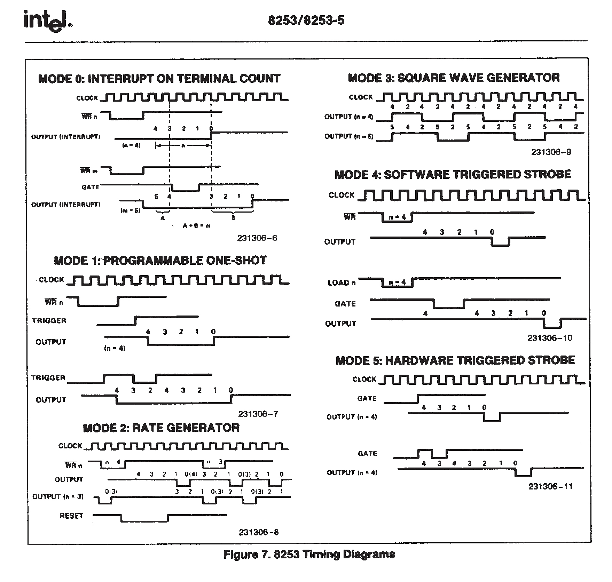

# 操作系统——计数器和时钟、蜂鸣器、时间、实时时钟

## 目录

常用的可编程定时计数器 (Programmable Interval Timer PIT) 有 Intel 8253/8254，其中 8254 可以称为 8253 的增强版。

在 8253 内部有 3 个独立的计数器，分别是计数器 0 ~ 2，端口号分别为 0x40 ~ 0x42；每个计数器完全相同，都是 16 位大小，相互独立，互不干涉。

8253 计数器是个减法计数器，从初值寄存器中得到初值，然后载入计数器中，然后随着时钟变化递减。计数器初值寄存器，计数器执行寄存器，和输出锁存器都是 16 位的寄存器，高八位和低八位可以单独访问。

## 计数器

三个计数器有自己各自的用途：

+ 计数器 0，端口号 0x40，用于产生时钟信号，它采用工作方式 3；
+ 计数器 1，端口号 0x41，用于 DRAM 的定时刷新控制；
+ 计数器 2，端口号 0x42，用于内部扬声器发出不同音调的声音，原理是给扬声器输送某频率的方波；

计数器 0 用于产生时钟中断，就是连接在 IRQ0 引脚上的时钟，也就是控制计数器 0 可以控制时钟发生的频率，以改变时间片(两个时钟中断之间的时间间隔)的间隔；

## 8253 控制字

控制字寄存器，端口号 0x43，是 8 位寄存器，控制字寄存器也成为模式控制寄存器，用于指定计数器的 工作方式、读写格式 及 数制。

控制字结构：

| 7   | 6   | 5   | 4   | 3   | 2   | 1   | 0   |
| --- | --- | --- | --- | --- | --- | --- | --- |
| SC1 | SC0 | RL1 | RL0 | M2  | M1  | M0  | BCD |

+ SC(Select Counter) 0 ~ 1：计数器选择位
  + 00 计数器 0
  + 01 计数器 1
  + 10 计数器 2
  + 11 无效
+ RL(Read Load) 0 ~ 1：读写操作位
  + 00 锁存数据，供 CPU 读
  + 01 只读写低字节
  + 10 只读写高字节
  + 11 先读写低字节，后读写高字节
+ M (Mode) 0 ~ 2：模式选择
  + 000：模式 0
  + 001：模式 1
  + 010：模式 2
  + 011：模式 3
  + 100：模式 4
  + 101：模式 5
+ BCD：(Binary Coded Decimal) 码
  + 0 表示二进制计数器
  + 1 二进制编码的十进制计数器

## 模式

+ 模式 0：计数结束时中断
+ 模式 1：硬件可重触发单稳方式
+ 模式 2：比率发生器，用于分频
+ 模式 3：方波发生器
+ 模式 4：软件触发选通
+ 模式 5：硬件触发选通

模式时序图

## 振荡器

振荡器的频率大概是 1193182 Hz，假设希望中断发生的频率为 100Hz，那么计数器初值寄存器的值为：

$$V = {1193182 \over 100} = 11931$$

## 其他的问题

+ 为什么 振荡器 的频率是 1193182 Hz？

最初的 PC 机，使用一个基础振荡器来生成频率，14.31818 MHz，因为这个频率常用于电视线路，这个基础频率除以 3 就得到了频率 4.77272666 MHz 用于 CPU；除以 4 得到频率 3.579545 MHz 用于 CGA 显卡控制器。从逻辑上将前两个频率求最大公约数，就得到了频率 1.1931816666 MHz，这个方案极大的节约了成本，因为 14.31818 MHz 的振荡器可以大量的生产，所以就更便宜。

## 扬声器

音频是录音设备在特定的时刻记录当时空气的张力值。

+ 位数：音频张力量化位数，采样的精度。
+ 采样率：每秒钟的采样数量，通常为 44100 Hz，或者 48000 Hz，人耳能听到的频率为 20 ~ 20000 Hz，而成年人一般只能听到 20 ~ 15000 Hz，所以根据 **奈奎斯特采样定律** 44100 Hz 的音频完全可以满足人耳的需要。采样率表示了，录音设备每秒采集数据的次数，也就是 bit 位数，每秒采集相应次数的数值，用来记录一秒内声音张力的变化；
+ 声道：声轨的数量，一般位为单声道或者立体声；
+ 码率（比特率）：每秒播放的字节数，可以估计出缓冲区大小，也就是 位数 * 采样率，一些编码方式可能有压缩，所以码率一般不是恒定的值；

PC Speaker 是 PC 兼容机中最原始的声音设备，特点是独特的蜂鸣效果，所以有时也被称为蜂鸣器；

扬声器有两种状态，输入和输出，状态可以通过键盘控制器中的端口号 `0x61` 设置，该寄存器结构如下：

| 位  | 描述            |
| --- | --------------- |
| 0   | 计数器 2 门有效 |
| 1   | 扬声器数据有效  |
| 2   | 通道校验有效    |
| 3   | 奇偶校验有效    |
| 4   | 保留            |
| 5   | 保留            |
| 6   | 通道错误        |
| 7   | 奇偶错误        |

需要将 0 ~ 1 位置为 1，然后计数器 2 设置成 方波模式，就可以播放方波的声音。

## 440 Hz

`A4 = 440Hz` 第一国际高度；

+ 小提琴：GDAE
+ 吉他：EADGBE
+ 二胡：DA
+ 琵琶：ADEA

## qemu 音频驱动

+ ALSA
+ coreaudio
+ dsound
+ oss
+ PulseAudio
+ SDL
+ spice
+ wav

## CMOS 信息

PC 机的 CMOS (Complementary metal oxide semiconductor 互补金属氧化物半导体) 内存，实际上是由电池供电的 64 或 128 字节 RAM 内存块，是系统时钟芯片的一部分。有些机器还有更大的内存容量。由 IBM 于 1984 年引入 PC 机，当时使用的芯片是摩托罗拉 MC146818A。

该 64 字节的 CMOS 原先在 IBM PC-XT 机器上用于保存时钟和日期信息，存放的格式是 BCD 码。由于这些信息仅用去 14 字节，剩余的字节就用来存放一些系统配置数据了。这里有独立的电池为其供电。

CMOS 的地址空间是在基本地址空间之外的。因此其中不包括可执行的代码。它需要使用在端口 `0x70`,`0x71` 使用 `in` 和 `out` 指令来访问。

为了读取指定偏移位置的字节，首先需要使用 `out` 向端口 `0x70` 发送指定字节的偏移值，然后使用 `in` 指令从 `0x71` 端口读取指定的字节信息。不过在选择字节（寄存器）时最好屏蔽到 NMI 中断。向 `0x70` 端口写入的 8 位的最高位 `0x80`。

下面是 CMOS 内存信息的一张简表。

| 地址偏移值  | 内容说明                    |
| ----------- | --------------------------- |
| 0x00        | 当前秒值 (实时钟)           |
| 0x01        | 闹钟秒值                    |
| 0x02        | 当前分钟 (实时钟)           |
| 0x03        | 闹钟分钟值                  |
| 0x04        | 当前小时值 (实时钟)         |
| 0x05        | 闹钟小时值                  |
| 0x06        | 一周中的当前天 (实时钟)     |
| 0x07        | 一月中的当日日期 (实时钟)   |
| 0x08        | 当前月份 (实时钟)           |
| 0x09        | 当前年份 (实时钟)           |
| 0x0a        | RTC 状态寄存器 A            |
| 0x0b        | RTC 状态寄存器 B            |
| 0x0c        | RTC 状态寄存器 C            |
| 0x0d        | RTC 状态寄存器 D            |
| 0x0e        | POST 诊断状态字节           |
| 0x0f        | 停机状态字节                |
| 0x10        | 磁盘驱动器类型              |
| 0x11        | 保留                        |
| 0x12        | 硬盘驱动器类型              |
| 0x13        | 保留                        |
| 0x14        | 设备字节                    |
| 0x15        | 基本内存 (低字节)           |
| 0x16        | 基本内存 (高字节)           |
| 0x17        | 扩展内存 (低字节)           |
| 0x18        | 扩展内存 (高字节)           |
| 0x19 ~ 0x2d | 保留                        |
| 0x2e        | 校验和 (低字节)             |
| 0x2f        | 校验和 (高字节)             |
| 0x30        | 1Mb 以上的扩展内存 (低字节) |
| 0x31        | 1Mb 以上的扩展内存 (高字节) |
| 0x32        | 当前所处世纪值              |
| 0x33        | 信息标志                    |

## 关键词

+ NMI 不可屏蔽中断

## 一些问题

+ 散装芯片？

CMOS 芯片集成了很多功能，有些甚至和时间无关，其中保存了 BIOS 启动时需要的一些信息，所以 CMOS 寄存器的值尽量不要修改，仅作只读之用，除非你非常明白自己在做什么，否则你需要更新 CMOS **校验和**。另外 CMOS 芯片还集成了 NMI 的开关。总之，在那个勤俭节约的年代，芯片只要有空间就要充分利用。节约成本，不过这确实留下了很多兼容性的包袱，鱼和熊掌，不可兼得。**先让程序跑起来吧，剩下的以后再说**。

+ 世纪寄存器？

最开始的 CMOS 中没有世纪寄存器，在接近 2000 年的时候，硬件厂商开始意识到这可能是个问题，所以添加了世纪寄存器 (`0x32`)，但是这并没有一个固定的标准，导致不同的硬件厂商使用了不同的寄存器。

+ 日历？

公元历法，1582 年，时任罗马教皇格里高利十三世予以批准执行，替代了原先的儒略历(Julian Calender)，故又称为格里高利历(Gregorian calendar)。

其中每四年一个闰年，每四百年减去三个闰年。

这里主要的原因是每个太阳年的时间大约是 365.2422 天；

但是，如果每年以 365 天计算的话，那么四年就要少 0.2422 * 4 = 0.9688 天，于是每隔四年会加一个闰年，这样每四年多计算了 0.0312 天；

但是，如果每四年都加天的话，那么四百年之后又多了 0.0312 * 100 = 3.12 天，于是在前面的每 100 年，又去掉一个闰年；

这样 400 年的误差被控制在了 0.12 天；这 0.12 天的误差要起效果，需要等待至少 3200 年，所以可能就忽略了吧。

## 实时时钟

RTC Real Time Clock 实时时钟

1. 轮询：时钟中断的时候不停的去检测
2. 实时中断

## 寄存器 A （读写）

### 第 7 位

正处于更新过程中 (Update In Progress, UIP)． 该位可以作为一个状态进行监视，CMOS RAM 中的时间和日期信息会由 RTC 周期性地更新，在此期间，用户程序不应当访问它们。对当前寄存器的写入不会改变此位的状态

+ 0: 更新周期至少在 488 微秒内不会启动，换句话说，此时访问 CMOS RAM 中的时间、日历和闹钟信息是安全的
+ 1: 正处于更新周期，或者马上就要启动

如果寄存器 B 的 SET 位不是 1 , 而且在分频电路已正确配置的情况下，更新周期每秒发生一次，在此期间，会增加保存的日期和时间、检查数据是否因超出范围而溢出（比如，31 号之后是下月 1 号，而不是 32 号)，还要检查是否到了闹钟时间，最后，更新之后的数据还要写回原来的位置；

更新周期至少会在 UIP 置为 1 后的 488μs 内开始，而且整个周期的完成时间不会多于 1984 μs, 在此期间，和日期时间有关的存储单元 (0x00 ~ 0x09) 会暂时脱离外部总线。

为避免更新和数据遭到破坏，可以有两次安全地从外部访问这些单元的机会：当检测到更新结束中断发生时， 可以有差不多999ms 的时间用于读写有效的日期和时间数据：如果检测到寄存器 A 的 UIP 位为低 (0) ，那么这意味若在更新周期开始前，至少还有 488μs 的时间。

### 第 6 ~ 4 位

分频电路选择 (Division Chain Select)，这 3 位控制晶体振荡器的分频电路。系统将其初始化到 010, 为 RTC 选择一个 32.768kHz 的时钟频率。

### 第 3 ~ 0 位

速率选择 (Rate Select, RS)，选择分频电路的分节点。如果寄存器 B 的 PIE 位被设置的话，此处的选择将产生一个周期性的中断信号，否则将设置寄存器 C 的 PF 标志位；默认是 0110，976.S62S μs

| 3 ~ 0 位 | 时间片       |
| -------- | ------------ |
| 0000     | 从不触发中断 |
| 0001     | 3.90625 ms   |
| 0010     | 7.8125 ms    |
| 0011     | 122.070 μs   |
| 0100     | 244.141 μs   |
| 0101     | 488.281 μs   |
| 0110     | 976.5625 μs  |
| 0111     | 1.953125 ms  |
| 1000     | 3.90625 ms   |
| 1001     | 7.8125 ms    |
| 1010     | 5.625 ms     |
| 1011     | 1.25 ms      |
| 1100     | 62.5 ms      |
| 1101     | 125 ms       |
| 1110     | 250 ms       |
| 1111     | 500 ms       |

## 寄存器 B （读写）

+ 7：更新周期禁止(Update Cycle Inhibit, SET)。允许或者禁止更新周期
  + 0: 更新周期每秒都会正常发生
  + 1: 中止当前的更新周期，井且此后不再产生更新周期，此位置 1 时，BIOS 可以安全地初始化日历和时间
+ 6：周期性中断允许(Periodic Interrupt Enable, PIE)
  + 0: 不允许
  + 1: 当达到寄存器 A 中 RS 所设定的时间基准时，允许产生中断
+ 5：闹钟中断允许(Alarm Interrupt Enable, AIE)
  + 0: 不允许
  + 1: 允许更新周期在到达闹钟点并将 AF 置位的同时，发出一个中断
+ 4：更新结束中断允许(Update-Ended Interrupt Enable, UIE)
  + 0: 不允许
  + 1: 允许在每个更新周期结束时产生中断
+ 3：方波允许(Square Wave Enable, SQWE)
    该位保留不用，只是为了和早期的 Motorola 146818B 实时时钟芯片保持一致
+ 2：数据模式(Data Mode, DM) 该位用于指定二进制或者 BCD 的数据表示形式
  + 0: BCD
  + 1: Binary
+ 1：小时格式(Hour Format, HOURFORM)
  + 0: 12 小时制，在这种模式下，第 7 位为 0 表示上午(AM)，为 1 表示下午(PM)
  + 1: 24 小时制
+ 0：老软件的夏令时支持(Daylight Savings Legacy Software Sport, DSLSWS)，该功能已不再支持，该位仅用于维持对老软件的支持，并且是无用的

## 寄存器 C (只读)

+ 7：中断请求标志(Interrupt Request Flag, IRQF)  
    > $IRQF = (PF \times PIE) + (AF \times AIE) + (UF \times UFE)$
    以上，加号表示逻辑或，乘号表示逻辑与。该位被设置时，表示肯定要发生中断，对寄存器 C 的读操作将导致此位清零

+ 6：周期性中断标志( Periodic Intenupt Flag, PF)

  + 若寄存器 A 的 RS 位为 0000, 则此位是 0
  + 否则是 1，对寄存器 C 的读操作将导致此位清零
  + 注：程序可以根据此位来判断 RTC 的中断原因

+ 5：闹钟标志( Alum Flag, AF)
  + 当所有闹点同当前时间相符时，此位是 1
  + 对寄存器 C 的读操作将导致此位清零
  + 注：程序可以根据此位来判断 RTC 的中断原因

+ 4 更新结束标志 (Update-Ended Flag, UF)
  + 紧接着每秒一次的更新周期之后，RTC 电路立即将此位置 1
  + 对寄存器 C 的读操作将导致此位清零
  + 注：程序可以根据此位来判断 RTC 的中断原因

+ 3 ~ 0：保留，总是报告 0

## 寄存器 D (读写)

+ 7：有效 RAM 和时间位(Valid RAM and Time Bit, VRT)
  + 在写周期，此位应当始终写 0
  + 在读周期，此位回到 1
  + 在RTC 加电正常时，此位被硬件强制为 1
+ 6：保留，总是返回 0．并且在写周期总是置 0
+ 5 ~ 0：日期闹钟(Date Alarm) ，这些位保存着闹钟的月份数值

## 参考文献

+ <https://www.cpcwiki.eu/imgs/e/e3/8253.pdf>
+ <https://wiki.osdev.org/Programmable_Interval_Timer>
+ 郑刚 - 《操作系统真象还原》

+ <http://blog.ccyg.studio/article/593eaa9a-7457-4561-ad97-7fabacb6c05d/>
+ <https://wiki.osdev.org/%228042%22_PS/2_Controller>
+ <https://www.cs.usfca.edu/~cruse/cs630f08/lesson15.ppt>
+ <https://wiki.osdev.org/PC_Speaker>
+ <https://www.kraxel.org/blog/2020/01/qemu-sound-audiodev/>
+ <https://www.qemu.org/docs/master/system/qemu-manpage.html>
+ <https://www.freedesktop.org/wiki/Software/PulseAudio/>

+ 赵炯 - 《Linux 内核完全注释》
+ <https://wiki.osdev.org/CMOS>
+ <https://en.wikipedia.org/wiki/Calendar>
+ <https://en.wikipedia.org/wiki/Gregorian_calendar>

+ 李忠 & 王晓波 & 余洁 - 《X86汇编语言》，电子工业出版社
+ [Motorola MC146818A Datasheet](http://www.datasheet.es/download.php?id=501896)
+ <https://wiki.osdev.org/RTC>
+ <http://bos.asmhackers.net/docs/timer/docs/cmos.pdf>
+ <https://web.archive.org/web/20150514082645/http://www.nondot.org/sabre/os/files/MiscHW/RealtimeClockFAQ.txt>
+ <https://www.qemu.org/docs/master/system/qemu-manpage.html?highlight=rtc%20localtime>
