# 操作系统——内存管理

从 loader 的内存检测结果获取可用内存区域，操作形式尽可能兼容 grub multiboot

以下是目前的内存分布图：



+ 386/486 内存分页是以 4K = 4096B = 0x1000B 为单位；
+ 奔腾处理器引入了以 4M 为单位的页；

从可用内存开始的位置分配一些页用于管理物理内存

每个物理页使用一个字节表示引用数量，意味着一个物理页最多被引用 255 次

```c++
// 分配一页物理内存
static u32 get_page()
// 释放一页物理内存
static void put_page(u32 addr)
```

## 参考文献

+ <https://www.gnu.org/software/grub/manual/multiboot2/multiboot.html>
+ <https://en.wikipedia.org/wiki/Memory_management_unit>

+ 赵炯 - 《Linux 内核完全注释》
