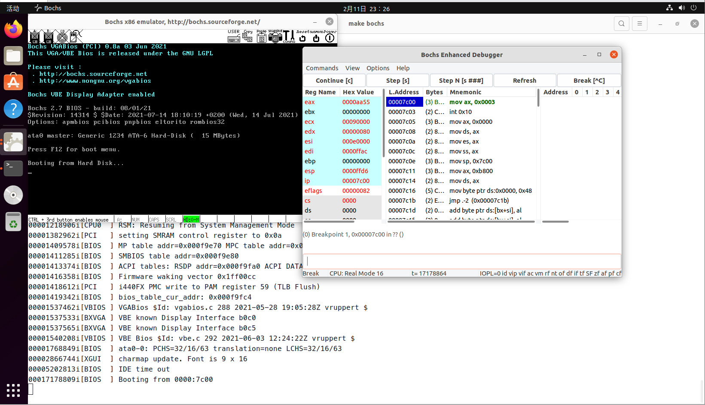

# 操作系统——主引导扇区

本次工作首先利用`makefile`将编译过程自动化，同时通过`bochs`调试来了解主引导扇区相关理论知识，然后向`boot`中添加实模式打印字符串功能

## makefile文件编写格式

目标文件/函数名称 ：依赖文件列表

例如：

```console
boot.bin : boot.asm
# 生成boot.bin需要依赖boot.asm

bochs : master.img
	bochs -q
# 执行bochs函数相关需要master.img文件
```

yes/no | 命令     (命令出现需要用户选择时自动选择相关选项)

例如：

```console
yes | bximage -q -hd=16 -func=create -sectsize=512 -imgmode=flat master.img 
# 在出现需要覆写时选择yes，自动覆盖已经存在的img
```

.PHONY           (不必检查生成文件时间戳，直接执行更新)

%.bin : %.asm: 模式编译，符合规则的文件全部编译

$< : 当前输入文件 

$@ : 当前输出文件

## BIOS（Bacis Input Output System）执行过程

+ `CPU`加电之后会把`CPU`所有寄存器的值设置为默认值，除了`CS`寄存器的为`0xFFFF`,其他寄存器值都为0，这样根据`CS:IP`的值就能够找到指令的物理地址，也就是`0xFFFF0`

+ 这时`CPU`就开始执行，在这个位置开始执行，这里存放着一条无条件跳转指令`JMP`，跳到`BIOS`真正启动代码处

+ `BIOS`首先先进行`POST(Power-Onself Test)`(加电后自检)，其主要检测系统中一些关键设备是否存在和能否正常工作；如果硬件出现问题，主板会发出不同含义的蜂鸣，启动中止；如果没有问题则显示出`CPU`、内存、硬盘等信息

+ `BIOS`程序在执行一些必要的开机自检和初始化后，会将自己复制到从`0xA0000`开始的物理内存中并继续执行

+ `BIOS`开始搜寻可引导的存储设备（即根据用户指定的引导顺序从软盘、硬盘或是可移动设备）。如果找到则将存储设备中的主引导扇区读入物理内存`0x7c00`继续执行，从而将`CPU`交给引导扇区中的`Boot`程序




## 实模式（8086模式）

+ `Boot`在执行过程中首先是进入实模式，其`CPU`的寄存器几乎都是`16`位，与其对应的是保护模式

+ 保护模式的操作系统需要通过实模式进入保护模式

+ 实模式寻址方式：
	> 有效地址  =  段地址 << 4 + 偏移地址

+ `16bit`需要寻址`1M`的空间，而`1M`空间需要`20Bit`来寻址，这样的矛盾诞生了上面的寻址方式来解决这个问题

## 主引导扇区的结构

+ 主引导扇区占用一个扇区共512B。

+ 代码：446B，硬盘分区表64B = 4 * 16B（所以一个硬盘最多可以有4个分区），魔数：0x55，0xaa（最后两个字节）

## 主引导扇区功能

读取内核加载器，并执行内核加载器。

## 实模式打印字符串

+ 首先在`bochsrc`中将`magic_break: enabled=0`改为`magic_break: enabled=1`，然后在`boot.asm`中在需要断点的地方添加`bochs`魔术断点

	```s
	xchg bx, bx
	```

+ 打印函数代码

	```s
	print:
    	mov ah, 0x0e
    	.next:
        	mov al, [si]
        	cmp al, 0
        	jz .done
        	int 0x10
        	inc si
        	jmp .next
    	.done
        	ret

	booting:
    	db "Booting Myos...", 10, 13, 0 ;\n\r\0
	```


