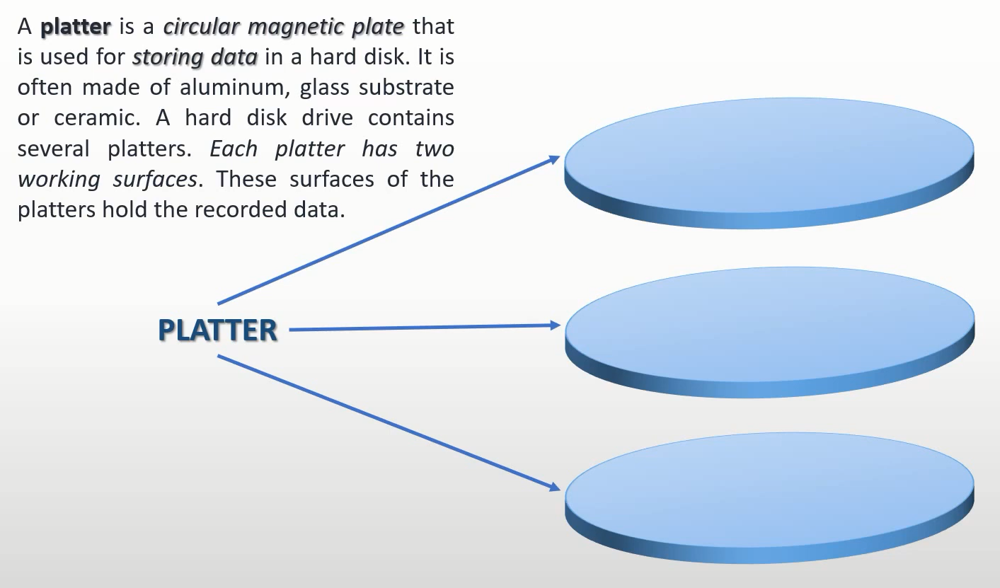
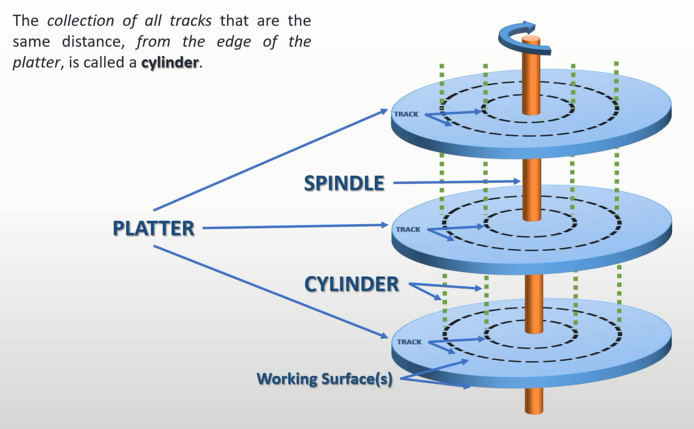
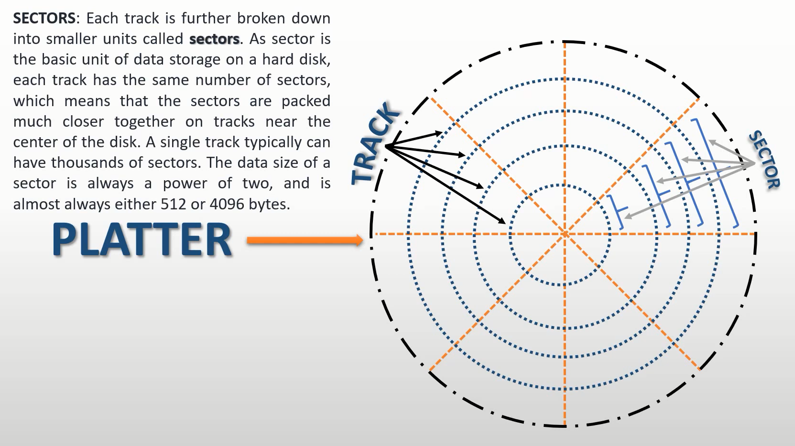

# 操作系统——硬盘读写

## 硬盘

---

---

---

---

---

---

---

+ 扇区：是硬盘读写的最小单位，最少1个，最多256个

+ 机械臂的寻道时间是硬盘性能的主要瓶颈

+ 一般情况下一个磁道有63个扇区，主要是由于`BIOS`最大支持63个扇区（现在已经变化）

+ 磁道从外侧计数，所以一般情况下C盘读写速度最快

## PIO Mode（Port Input Output Mode）端口输入输出模式

端口可以理解为外部设备内部的寄存器

`PIO`分为以下两种：

+ `IDE: Intergrated Drive Electronics` 集成电子驱动器 ————80年代西部数据制造（硬盘厂商）

+ `ATA: Advanced Technology Attachment`————由美国国家标准学会提出

+ 后续发展出`SATA`,原`ATA`被称为`PATA`

## 硬盘读写

硬盘读写有两种方式：

+ `CHS`模式：`Cylinder`(柱面)、`Head`（磁头）、`Sector`（磁道）

+ `LBA`模式：`Logical Block Address`（逻辑块地址）

+ 本次操作系统编写采用`LBA28`模式————采用28为二进制位数来表示扇区编号，即其能够访问`128G`的磁盘空间

+ 磁盘控制端口表

    | Primary 通道            | Secondary 通道 | in 操作      | out 操作     |
    | ----------------------- | -------------- | ------------ | ------------ |
    | 0x1F0                   | 0x170          | Data         | Data         |
    | 0x1F1                   | 0x171          | Error        | Features     |
    | 0x1F2                   | 0x172          | Sector count | Sector count |
    | 0x1F3                   | 0x173          | LBA low      | LBA low      |
    | 0x1F4                   | 0x174          | LBA mid      | LBA mid      |
    | 0x1F5                   | 0x175          | LBA high     | LBA high     |
    | 0x1F6                   | 0x176          | Device       | Device       |
    | 0x1F7                   | 0x177          | Status       | Command      |

  + `0x1F0`：16bit端口，用来读写数据

  + `0x1F1`：检测前一个指令的错误

  + `0x1F2`：读写扇区的数量，最多是256个扇区

  + `0x1F3`：起始扇区编号的0 ~ 7位

  + `0x1F4`：起始扇区编号的8 ~ 15位

  + `0x1F5`：起始扇区编号的16 ~ 23位

  + `0x1F6`：

    + `0 ~ 3`： 起始扇区编号的24 ~ 27位

    + `4`：0表示主盘，1表示从片

    + `6`：0表示CHS模式，1表示LBA模式

    + `5、7`：固定为1

  + `0x1F7`：out

    + `0xEC`: 识别硬盘

    + `0x20`: 读硬盘

    + `0x30`: 写硬盘

  + `0x1F7`：in，为8bit数据

    + `0`: ERROR

    + `3`: DRQ 数据准备完毕

    + `7`: BSY 硬盘繁忙

## 参考文献

+ <https://www.youtube.com/watch?v=oEORcCQ62nQ>
+ <https://wiki.osdev.org/ATA_PIO_Mode>
+ <https://bochs.sourceforge.io/techspec/PORTS.LST>
+ <https://www.techtarget.com/searchstorage/definition/IDE>
