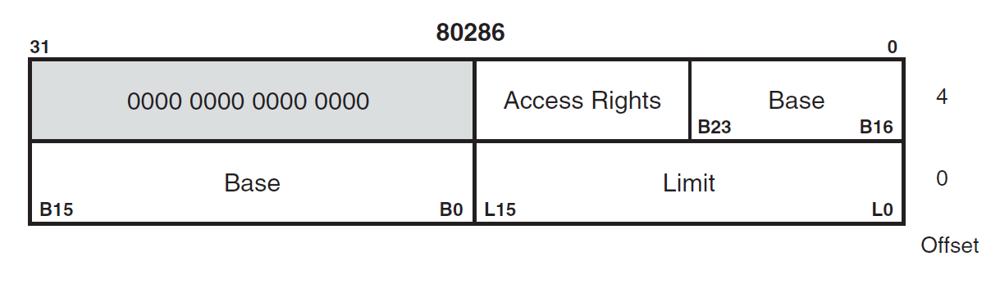
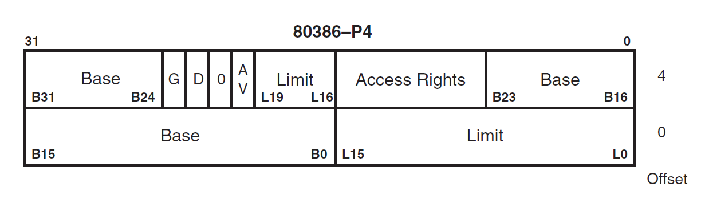

# 操作系统——内核加载器

## boot进入内核加载器过程

+ 从主引导扇区读入

+ 检测正确性

+ 跳转到`loader`执行

## 将loader写入硬盘命令
```console
dd if=loader.bin of=master.img bs=512 count=4 seek=2 conv=notrunc
// seek: 写入内容的开始扇区
```

## 实模式内存布局——关于写入内容位置0x1000

| 起始地址  | 结束地址  | 大小     | 用途               |
| --------- | --------- | -------- | ------------------ |
| `0x000`   | `0x3FF`   | 1KB      | 中断向量表         |
| `0x400`   | `0x4FF`   | 256B     | BIOS 数据区        |
| `0x500`   | `0x7BFF`  | 29.75 KB | 可用区域           |
| `0x7C00`  | `0x7DFF`  | 512B     | MBR 加载区域       |
| `0x7E00`  | `0x9FBFF` | 607.6KB  | 可用区域           |
| `0x9FC00` | `0x9FFFF` | 1KB      | 扩展 BIOS 数据区   |
| `0xA0000` | `0xAFFFF` | 64KB     | 用于彩色显示适配器 |
| `0xB0000` | `0xB7FFF` | 32KB     | 用于黑白显示适配器 |
| `0xB8000` | `0xBFFFF` | 32KB     | 用于文本显示适配器 |
| `0xC0000` | `0xC7FFF` | 32KB     | 显示适配器 BIOS    |
| `0xC8000` | `0xEFFFF` | 160KB    | 映射内存           |
| `0xF0000` | `0xFFFEF` | 64KB-16B | 系统 BIOS          |
| `0xFFFF0` | `0xFFFFF` | 16B      | 系统 BIOS 入口地址 |

+ 两块可用区域较小的一块用作放入`loader`，另一块用来放入操作系统内核

## 内核加载器功能——内存检测

+ 由于操作系统运行时并不知道内存的大小，可用范围等信息，所以需要内存检测这个过程来探知这些信息

+ `BIOS`的0x15中断的子功能0xe820提供了内存检测功能，其返回一个`ARDS（Address Range Descriptor Atructure）`（地址范围描述符）的数据结构，其结构如下：

    | 字节偏移量 | 属性名称     | 描述                             |
    | ---------- | ------------ | -------------------------------- |
    | 0          | BaseAddrLow  | 基地址的低 32 位                 |
    | 4          | BaseAddrHigh | 基地址的高 32 位                 |
    | 8          | LengthLow    | 内存长度的低 32 位，以字节为单位 |
    | 12         | LengthHigh   | 内存长度的高 32 位，以字节为单位 |
    | 16         | Type         | 本段内存的类型                   |
    其中Type字段各个值如下：

    | Type 值 | 名称                 | 描述                                                                                 |
    | ------- | -------------------- | ------------------------------------------------------------------------------------ |
    | 1       | AddressRangeMemory   | 这段内存可以被操作系统使用                                                           |
    | 2       | AddressRangeReserved | 内存使用中或者被系统保留，操作系统不可以用此内存                                     |
    | 其他    | 未定义               | 未定义，将来会用到．目前保留． 但是需要操作系统一样将其视为ARR(AddressRangeReserved) |

## 调用前输入

| 寄存器或状态位 | 参数用途                                                                                                                                                                                                                                                                                                 |
| -------------- | -------------------------------------------------------------------------------------------------------------------------------------------------------------------------------------------------------------------------------------------------------------------------------------------------------- |
| EAX            | 子功能号： EAX 寄存器用来指定子功能号，此处输入为 0xE820                                                                                                                                                                                                                                                 |
| EBX            | 内存信息需要按类型分多次返回，由于每次执行一次中断都只返回一种类型内存的ARDS 结构，所以要记录下一个待返回的内存ARDS，在下一次中断调用时通过此值告诉 BIOS 该返回哪个 ARDS，这就是后续值的作用。第一次调用时一定要置为0，EBX 具体值我们不用关注，字取决于具体 BIOS 的实现，每次中断返回后，BIOS 会更新此值 |
| ES: DI         | ARDS 缓冲区：BIOS 将获取到的内存信息写入此寄存器指向的内存，每次都以 ARDS 格式返回                                                                                                                                                                                                                       |
| ECX            | ARDS 结构的字节大小：用来指示 BIOS 写入的字节数。调用者和 BIOS 都同时支持的大小是 20 字节，将来也许会扩展此结构                                                                                                                                                                                          |
| EDX            | 固定为签名标记 `0x534d4150`，此十六进制数字是字符串 `SMAP` 的ASCII 码： BIOS 将调用者正在请求的内存信息写入 ES: DI 寄存器所指向的ARDS 缓冲区后，再用此签名校验其中的信息                                                                                                                                 |

## 调用返回

| 寄存器或状态位 | 参数用途                                                                                                                                                                                                                                   |
| -------------- | ------------------------------------------------------------------------------------------------------------------------------------------------------------------------------------------------------------------------------------------ |
| CF 位          | 若CF 位为 0 表示调用未出错，CF 为1，表示调用出错                                                                                                                                                                                           |
| EAX            | 字符串 SMAP 的 ASCII 码 `0x534d4150`                                                                                                                                                                                                       |
| ES:DI          | ARDS 缓冲区地址，同输入值是一样的，返回时此结构中己经被BIOS 填充了内存信息                                                                                                                                                                 |
| ECX            | BIOS 写入到 ES:DI 所指向的 ARDS 结构中的字节数，BIOS 最小写入 20 字节                                                                                                                                                                      |
| EBX            | 后续值：下一个 ARDS 的位置。每次中断返回后，BIOS 会更新此值， BIOS 通过此值可以找到下一个待返回的 ARDS 结构，咱们不需要改变 EBX 的值，下一次中断调用时还会用到它。在 CF 位为 0 的情况下，若返回后的 EBX 值为 0，表示这是最后一个 ARDS 结构 |

## 内核加载器——进入保护模式和全局描述符

### 保护模式意义

+ 地址能够访问20位以上的地址

+ 对内存管理设置权限，防止意外操作（权限管理方法就是描述符）

### 全局描述符



---



+ 其描述内存的起始位置、长度 / 界限（长度 - 1）、属性，对内存进行管理

    ```cpp
    typedef struct descriptor /* 共 8 个字节 */
    {
        unsigned short limit_low;      // 段界限 0 ~ 15 位
        unsigned int base_low : 24;    // 基地址 0 ~ 23 位 16M
        unsigned char type : 4;        // 段类型
        unsigned char segment : 1;     // 1 表示代码段或数据段，0 表示系统段
        unsigned char DPL : 2;         // Descriptor Privilege Level 描述符特权等级 0 ~ 3
        unsigned char present : 1;     // 存在位，1 在内存中，0 在磁盘上
        unsigned char limit_high : 4;  // 段界限 16 ~ 19;
        unsigned char available : 1;   // 该安排的都安排了，送给操作系统吧
        unsigned char long_mode : 1;   // 64 位扩展标志
        unsigned char big : 1;         // 32 位 还是 16 位;
        unsigned char granularity : 1; // 粒度 4KB 或 1B
        unsigned char base_high;       // 基地址 24 ~ 31 位
    } __attribute__((packed)) descriptor;
    ```

+ | X | C/E | R/W | A |

    + A: Accessed 是否被 CPU 访问过
    + X: 1/代码 0/数据
    + X = 1：代码段
        + C: 是否是依从代码段
        + R: 是否可读
    + X = 0: 数据段
        + E: 0 向上扩展 / 1 向下扩展
        + W: 是否可写

### 全局描述符表 GDT Global Descriptor Table

```cpp
descriptor gdt[8192];
```
+因为段寄存器是16位，但由于CPU设计上的原因，段寄存器的低3位不能用，因此只能用13位来表示段号，2^(10+3)=8*1024=8192，则能够处理段号为0~8191

+ 0 必须全为 0 - NULL 描述符
+ 8191 描述符


+ gdtr / 全局描述符表的起始位置和长度

```s
lgdt [gdt_ptr]; 加载 gdt
sgdt [gdt_ptr]; 保存 gdt
```

```cpp
typedef struct pointer
{
    unsigned short limit; // size - 1
    unsigned int base;
} __attribute__((packed)) pointer;
```

### 段选择子

+ 只需要一个代码段
+ 需要一个或多个数据段 / 栈段 / 数据段
+ 加载到段寄存器中 / 校验特权级

```cpp
typedef struct selector
{
    unsigned char RPL : 2; // Request PL 
    unsigned char TI : 1; // 0  全局描述符 1 局部描述符 LDT Local 
    unsigned short index : 13; // 全局描述符表索引
} __attribute__((packed)) selector;
```

+ cs / ds / es / ss
+ fs / gs

### A20 线

8086 1M 

段地址 * 16 + 偏移地址 > 1M

80286 16M 24 根地址线
386 32 地址线，4G

地址回绕

0x92 端口

- <https://wiki.osdev.org/A20>
- <https://wiki.osdev.org/Non_Maskable_Interrupt>

### PE Protect Enable

`cr0` 寄存器`0`位置为`1`


## 参考文献

- <https://wiki.osdev.org/Detecting_Memory_(x86)>