# 操作系统——进入内核，切换开发语言

## ELF文件

Executable and Linking Format / 可执行和链接的格式

+ 可执行程序 /python / bash / gcc

+ 可重定位文件 / gcc -c `.o` / 静态库 `ar`命令-`.a`

+ 共享目标文件 / 动态链接库 .so

## 可执行程序

+ 代码 .text section ELF / segment CPU

+ 数据 
    + .data section / 已经初始化过的数据
    + .bss section / 未初始化过的数据 Block Started by Symbol

## 程序分析

编译成为`32`位程序：

    ```console
    g++ -m32 hello.cpp -o hello
    ```

读取ELF文件内容：

    ```console
    readelf -e hello
    ```

## 编译和链接
    


+ 预处理命令：

    ```console
    g++ -m32 -E main.cpp -I../include > test.c 
    # -E 预编译 -I 依赖文件 >输出文件 
    ```

    预处理结果：

    ```c++
    # 0 "main.cpp"
    # 0 "<built-in>"
    # 0 "<command-line>"
    # 1 "/usr/include/stdc-predef.h" 1 3 4
    # 0 "<command-line>" 2
    # 1 "main.cpp"
    # 1 "../include/myos/myos.h" 1

    void kernel_init();
    # 2 "main.cpp" 2

    int magic = 20220205;
    char message[] = "Hello world!!!";
    char buf[1024];

    void kernel_init()
    {
        char *video = (char *)0xb8000;
        for (int i = 0; i < sizeof(message); i++)
        {
            video[i * 2] = message[i];
        }
    }

    ```

+ 编译命令：

    ```console
    g++ -m32 -S test.c > test.s 
    # -S 编译 >输出文件 
    ```

    编译结果：

    ```s
        .file	"test.c"
        .text
        .globl	magic
        .data
        .align 4
        .type	magic, @object
        .size	magic, 4
    magic:
        .long	20220205
        .globl	message
        .align 4
        .type	message, @object
        .size	message, 15
    message:
        .string	"Hello world!!!"
        .globl	buf
        .bss
        .align 32
        .type	buf, @object
        .size	buf, 1024
    buf:
        .zero	1024
        .text
        .globl	_Z11kernel_initv
        .type	_Z11kernel_initv, @function
    _Z11kernel_initv:
    .LFB0:
        .cfi_startproc
        pushl	%ebp
        .cfi_def_cfa_offset 8
        .cfi_offset 5, -8
        movl	%esp, %ebp
        .cfi_def_cfa_register 5
        pushl	%ebx
        subl	$16, %esp
        .cfi_offset 3, -12
        call	__x86.get_pc_thunk.ax
        addl	$_GLOBAL_OFFSET_TABLE_, %eax
        movl	$753664, -8(%ebp)
        movl	$0, -12(%ebp)
        jmp	.L2
    .L3:
        movl	-12(%ebp), %edx
        addl	%edx, %edx
        movl	%edx, %ecx
        movl	-8(%ebp), %edx
        addl	%edx, %ecx
        leal	message@GOTOFF(%eax), %ebx
        movl	-12(%ebp), %edx
        addl	%ebx, %edx
        movzbl	(%edx), %edx
        movb	%dl, (%ecx)
        addl	$1, -12(%ebp)
    .L2:
        movl	-12(%ebp), %edx
        cmpl	$14, %edx
        jbe	.L3
        nop
        nop
        movl	-4(%ebp), %ebx
        leave
        .cfi_restore 5
        .cfi_restore 3
        .cfi_def_cfa 4, 4
        ret
        .cfi_endproc
    .LFE0:
        .size	_Z11kernel_initv, .-_Z11kernel_initv
        .section	.text.__x86.get_pc_thunk.ax,"axG",@progbits,__x86.get_pc_thunk.ax,comdat
        .globl	__x86.get_pc_thunk.ax
        .hidden	__x86.get_pc_thunk.ax
        .type	__x86.get_pc_thunk.ax, @function
    __x86.get_pc_thunk.ax:
    .LFB1:
        .cfi_startproc
        movl	(%esp), %eax
        ret
        .cfi_endproc
    .LFE1:
        .ident	"GCC: (Ubuntu 11.2.0-7ubuntu2) 11.2.0"
        .section	.note.GNU-stack,"",@progbits
    ```

+ 汇编命令

    ```console
    as -32 test.s -o test.o        
    ```
    利用`readelf -a`查看文件内容：

    ```console
    ELF 头：
    Magic：   7f 45 4c 46 01 01 01 00 00 00 00 00 00 00 00 00 
    类别:                              ELF32
    数据:                              2 补码，小端序 (little endian)
    Version:                           1 (current)
    OS/ABI:                            UNIX - System V
    ABI 版本:                          0
    类型:                              REL (可重定位文件)
    系统架构:                          Intel 80386
    版本:                              0x1
    入口点地址：               0x0
    程序头起点：          0 (bytes into file)
    Start of section headers:          696 (bytes into file)
    标志：             0x0
    Size of this header:               52 (bytes)
    Size of program headers:           0 (bytes)
    Number of program headers:         0
    Size of section headers:           40 (bytes)
    Number of section headers:         14
    Section header string table index: 13

    节头：
    [Nr] Name              Type            Addr     Off    Size   ES Flg Lk Inf Al
    [ 0]                   NULL            00000000 000000 000000 00      0   0  0
    [ 1] .group            GROUP           00000000 000034 000008 04     11   8  4
    [ 2] .text             PROGBITS        00000000 00003c 000050 00  AX  0   0  1
    [ 3] .rel.text         REL             00000000 000214 000018 08   I 11   2  4
    [ 4] .data             PROGBITS        00000000 00008c 000013 00  WA  0   0  4
    [ 5] .bss              NOBITS          00000000 0000a0 000400 00  WA  0   0 32
    [ 6] .text.__x86.[...] PROGBITS        00000000 0000a0 000004 00 AXG  0   0  1
    [ 7] .comment          PROGBITS        00000000 0000a4 000026 01  MS  0   0  1
    [ 8] .note.GNU-stack   PROGBITS        00000000 0000ca 000000 00      0   0  1
    [ 9] .eh_frame         PROGBITS        00000000 0000cc 000050 00   A  0   0  4
    [10] .rel.eh_frame     REL             00000000 00022c 000010 08   I 11   9  4
    [11] .symtab           SYMTAB          00000000 00011c 0000a0 10     12   4  4
    [12] .strtab           STRTAB          00000000 0001bc 000057 00      0   0  1
    [13] .shstrtab         STRTAB          00000000 00023c 00007a 00      0   0  1
    Key to Flags:
    W (write), A (alloc), X (execute), M (merge), S (strings), I (info),
    L (link order), O (extra OS processing required), G (group), T (TLS),
    C (compressed), x (unknown), o (OS specific), E (exclude),
    D (mbind), p (processor specific)

    COMDAT group section [    1] `.group' [__x86.get_pc_thunk.ax] contains 1 sections:
    [Index]    Name
    [    6]   .text.__x86.get_pc_thunk.ax

    本文件中没有程序头。

    There is no dynamic section in this file.

    重定位节 '.rel.text' at offset 0x214 contains 3 entries:
    偏移量     信息    类型              符号值      符号名称
    00000008  00000802 R_386_PC32        00000000   __x86.get_pc_thunk.ax
    0000000d  0000090a R_386_GOTPC       00000000   _GLOBAL_OFFSET_TABLE_
    0000002f  00000509 R_386_GOTOFF      00000004   message

    重定位节 '.rel.eh_frame' at offset 0x22c contains 2 entries:
    偏移量     信息    类型              符号值      符号名称
    00000020  00000202 R_386_PC32        00000000   .text
    00000044  00000302 R_386_PC32        00000000   .text.__x86.get_p[...]
    No processor specific unwind information to decode

    Symbol table '.symtab' contains 10 entries:
    Num:    Value  Size Type    Bind   Vis      Ndx Name
        0: 00000000     0 NOTYPE  LOCAL  DEFAULT  UND 
        1: 00000000     0 FILE    LOCAL  DEFAULT  ABS test.c
        2: 00000000     0 SECTION LOCAL  DEFAULT    2 .text
        3: 00000000     0 SECTION LOCAL  DEFAULT    6 .text.__x86.get_[...]
        4: 00000000     4 OBJECT  GLOBAL DEFAULT    4 magic
        5: 00000004    15 OBJECT  GLOBAL DEFAULT    4 message
        6: 00000000  1024 OBJECT  GLOBAL DEFAULT    5 buf
        7: 00000000    80 FUNC    GLOBAL DEFAULT    2 _Z11kernel_initv
        8: 00000000     0 FUNC    GLOBAL HIDDEN     6 __x86.get_pc_thunk.ax
        9: 00000000     0 NOTYPE  GLOBAL DEFAULT  UND _GLOBAL_OFFSET_TABLE_
    ```

+ 链接命令：

    ```console
    ld -m elf_i386 -static test.o -o test.out -e _Z11kernel_initv
    ```

    利用`readelf -a`查看文件内容：

    ```console
    ELF 头：
    Magic：   7f 45 4c 46 01 01 01 00 00 00 00 00 00 00 00 00 
    类别:                              ELF32
    数据:                              2 补码，小端序 (little endian)
    Version:                           1 (current)
    OS/ABI:                            UNIX - System V
    ABI 版本:                          0
    类型:                              EXEC (可执行文件)
    系统架构:                          Intel 80386
    版本:                              0x1
    入口点地址：               0x8049000
    程序头起点：          52 (bytes into file)
    Start of section headers:          12732 (bytes into file)
    标志：             0x0
    Size of this header:               52 (bytes)
    Size of program headers:           32 (bytes)
    Number of program headers:         5
    Size of section headers:           40 (bytes)
    Number of section headers:         10
    Section header string table index: 9

    节头：
    [Nr] Name              Type            Addr     Off    Size   ES Flg Lk Inf Al
    [ 0]                   NULL            00000000 000000 000000 00      0   0  0
    [ 1] .text             PROGBITS        08049000 001000 000054 00  AX  0   0  1
    [ 2] .eh_frame         PROGBITS        0804a000 002000 000050 00   A  0   0  4
    [ 3] .got.plt          PROGBITS        0804c000 003000 00000c 04  WA  0   0  4
    [ 4] .data             PROGBITS        0804c00c 00300c 000013 00  WA  0   0  4
    [ 5] .bss              NOBITS          0804c020 00301f 000400 00  WA  0   0 32
    [ 6] .comment          PROGBITS        00000000 00301f 000025 01  MS  0   0  1
    [ 7] .symtab           SYMTAB          00000000 003044 0000c0 10      8   4  4
    [ 8] .strtab           STRTAB          00000000 003104 00006f 00      0   0  1
    [ 9] .shstrtab         STRTAB          00000000 003173 000048 00      0   0  1
    Key to Flags:
    W (write), A (alloc), X (execute), M (merge), S (strings), I (info),
    L (link order), O (extra OS processing required), G (group), T (TLS),
    C (compressed), x (unknown), o (OS specific), E (exclude),
    D (mbind), p (processor specific)

    There are no section groups in this file.

    程序头：
    Type           Offset   VirtAddr   PhysAddr   FileSiz MemSiz  Flg Align
    LOAD           0x000000 0x08048000 0x08048000 0x000d4 0x000d4 R   0x1000
    LOAD           0x001000 0x08049000 0x08049000 0x00054 0x00054 R E 0x1000
    LOAD           0x002000 0x0804a000 0x0804a000 0x00050 0x00050 R   0x1000
    LOAD           0x003000 0x0804c000 0x0804c000 0x0001f 0x00420 RW  0x1000
    GNU_STACK      0x000000 0x00000000 0x00000000 0x00000 0x00000 RW  0x10

    Section to Segment mapping:
    段节...
    00     
    01     .text 
    02     .eh_frame 
    03     .got.plt .data .bss 
    04     

    There is no dynamic section in this file.

    该文件中没有重定位信息。
    No processor specific unwind information to decode

    Symbol table '.symtab' contains 12 entries:
    Num:    Value  Size Type    Bind   Vis      Ndx Name
        0: 00000000     0 NOTYPE  LOCAL  DEFAULT  UND 
        1: 00000000     0 FILE    LOCAL  DEFAULT  ABS test.c
        2: 00000000     0 FILE    LOCAL  DEFAULT  ABS 
        3: 0804c000     0 OBJECT  LOCAL  DEFAULT    3 _GLOBAL_OFFSET_TABLE_
        4: 08049000    80 FUNC    GLOBAL DEFAULT    1 _Z11kernel_initv
        5: 08049050     0 FUNC    GLOBAL HIDDEN     1 __x86.get_pc_thunk.ax
        6: 0804c010    15 OBJECT  GLOBAL DEFAULT    4 message
        7: 0804c01f     0 NOTYPE  GLOBAL DEFAULT    5 __bss_start
        8: 0804c020  1024 OBJECT  GLOBAL DEFAULT    5 buf
        9: 0804c00c     4 OBJECT  GLOBAL DEFAULT    4 magic
        10: 0804c01f     0 NOTYPE  GLOBAL DEFAULT    4 _edata
        11: 0804c420     0 NOTYPE  GLOBAL DEFAULT    5 _end
    ```

+  g++的集成编译链接

    ```console
    g++ --verbose -m32 main.cpp -I../include -o main.out -e _Z11kernel_initv -nostartfiles
    -nostartfiles : 程序不需要利用系统调用  --verbose : 显示编译过程细节
    ```

    ```console
    g++ -m32 -g -I./include -c kernel/main.cpp -o ../build/kernel/main.o
    -c : 只激活预处理,编译,和汇编
    ```

## 参考文献

<https://refspecs.linuxfoundation.org/elf/elf.pdf>