# 操作系统——任务及上下文

## 任务

任务就是进程或者线程，协程，就是一个执行流；

+ 程序入口地址
+ 堆栈 - 内核栈
+ 寄存器信息

## ABI 调用约定

Application Binary Interface (应用二进制接口)

System V ABI（Linux）

调用方保存：

+ eax
+ ecx
+ edx

实现方保存，调用完成后寄存器值不变：

+ ebx
+ esi
+ edi
+ ebp
+ esp

## 内存分页

4G / 4K = 1M

## 任务内存分布

## 参考文献

+ <https://en.wikipedia.org/wiki/Application_binary_interface>
+ <https://stackoverflow.com/questions/2171177/what-is-an-application-binary-interface-abi>
+ <https://wiki.osdev.org/System_V_ABI>
